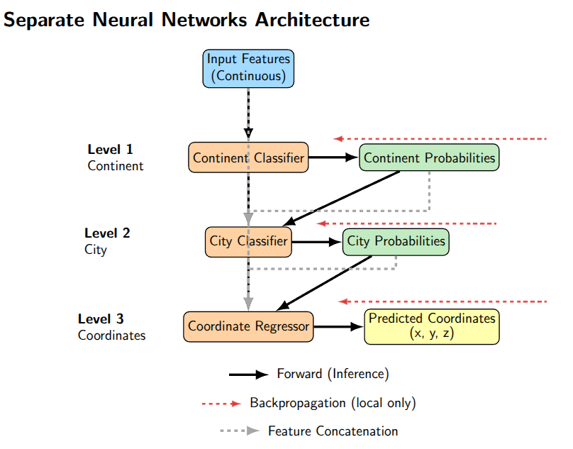
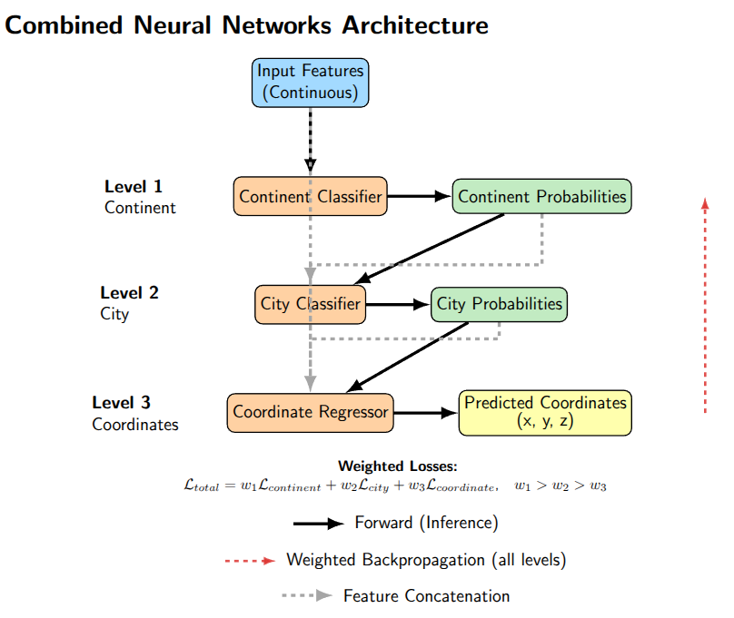
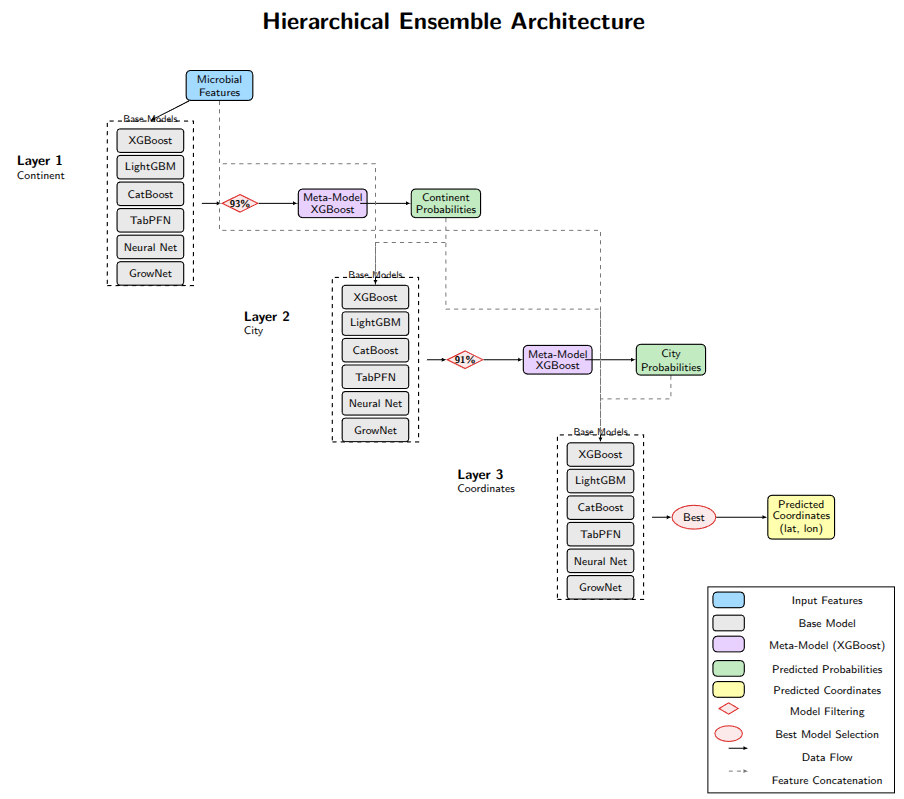

# mGPS Optimization

## BINP37: Research Project (15 cr)

This repository contains code, data, and documentation for hierarchical machine learning approaches to predict the geographic origin of environmental metagenomic samples. The project builds on the MetaSUB dataset and advances the state-of-the-art in microbiome geolocation, surpassing previous tools such as mGPS.

---

## 👤 Author

- [@ChandrashekarCR](https://github.com/ChandrashekarCR)

---

## 📝 Overview

Accurate prediction of sample origin from microbial signatures is crucial for biosurveillance, forensic science, and public health. This project introduces a robust ensemble learning framework leveraging neural networks, GrowNet, gradient boosting decision trees, and transformer-based models for improved classification and coordinate prediction.

---

## 🚀 Key Features

- **Hierarchical Prediction:**  
  Models predict continent, city, and precise coordinates in a sequential framework.
- **Ensemble Learning:**  
  Combines XGBoost, LightGBM, CatBoost, TabPFN, neural networks, and GrowNet using meta-models for optimal performance.
- **Error Propagation Analysis:**  
  Introduces a mathematical framework to quantify how misclassifications at higher levels affect coordinate predictions.
- **Advanced Feature Selection:**  
  Utilizes recursive feature elimination (RFE) and SMOTE for class imbalance correction.
- **Scalable Architecture:**  
  Designed to handle larger and more diverse datasets than previous approaches.

---

## 📊 Results

- **Median Coordinate Error:**  
  Ensemble model: **13.7 km** vs. mGPS: **137 km**
- **Classification Accuracy:**  
  95% continent, 93% city (MetaSUB dataset)
- **Robustness:**  
  Strong performance for underrepresented regions.
- **Fine-Scale Localization:**  
  Distinguishes neighborhoods/districts within cities.

---

### 📍 Global Distribution of MetaSUB Sampling Sites

*Shows the worldwide locations and sample counts for the MetaSUB dataset. The map highlights geographic diversity and sampling density, with regional breakdowns for Europe, North America, and Asia-Pacific. The color scale (log scale) indicates the number of samples per city, illustrating which cities and continents are well or poorly represented.*


---

### 🦠 Taxonomic Diversity in MetaSUB Dataset

*Summarizes the taxonomic composition of the MetaSUB samples at multiple levels (superphylum, phylum, class, order). Bacteria dominate the dataset, with Pseudomonadota and Actinomycetota as major groups. The plot provides insight into the microbial diversity available for geographic prediction.*


---

### 🌍 All Cities: True vs Predicted Coordinates

*Overlays the true sample locations (blue) and the predicted locations (red) for all test samples. The close proximity of predicted points to true points across continents and cities demonstrates the ensemble model's ability to accurately localize samples worldwide.*


---

### 🎯 Effect of Classification Correctness on Geographical Error

*Illustrates the relationship between classification correctness (continent/city) and the resulting geodesic error in coordinate prediction. Samples correctly classified at higher levels have dramatically lower coordinate errors, highlighting the importance of robust hierarchical classification for precise geographic localization.*


---

## 📁 Repository Structure

```text
binp37/
├── data/                # Raw and processed data
│   ├── metasub/         # MetaSUB dataset and metadata
│   ├── geopandas/       # Geospatial mapping data
├── notebooks/           # Jupyter notebooks for analysis and visualization
├── scripts/             # Source code for preprocessing, modeling, and feature engineering
│   ├── data_preprocess/         # Data cleaning and preparation scripts
│   ├── feature_engineering/     # Feature selection and taxonomic enrichment
│   ├── nn_models/               # Neural network models (separate & combined)
│   ├── grownet/                 # GrowNet and hierarchical boosting models
│   ├── ensemble/                # Ensemble learning pipeline and model scripts
├── report/              # LaTeX manuscript and figures
│   ├── figures/         # Plots and diagrams for the manuscript
│   ├── workflows/       # Workflow diagrams (PDF/TEX)
│   ├── main.pdf         # Report
├── results/             # Model outputs and processed datasets
│   ├── metasub/
├── environment.yml      # Conda environment specification
├── README.md            # Project documentation
```

---

## 🏁 Getting Started

### 1. Clone the repository
```sh
git clone https://github.com/ChandrashekarCR/mgps_optimization.git
cd mgps_optimization
```

### 2. Set up the environment
```sh
conda env create -f environment.yml
conda activate binp37_env
```

### 3. Data Preparation

**Preprocessing the MetaSUB Dataset**

- Main script: `/scripts/data_preprocess/preprocess_metasub.py`
- **Purpose:**  
  - Merges taxonomic abundance data with sample metadata.
  - Performs quality control, removing cities with insufficient samples.
  - Corrects mislabelled coordinates and harmonizes metadata fields.
  - Outputs a clean, analysis-ready CSV file.

- **Required Input Files:**  
  - Taxa abundance: `/data/metasub/metasub_taxa_abundance.csv`
  - Metadata: `/data/metasub/complete_metadata.csv`

- **How to Run:**
  ```sh
  python3 scripts/data_preprocess/preprocess_metasub.py \
    -m /data/metasub/complete_metadata.csv \
    -t /data/metasub/metasub_taxa_abundance.csv \
    -o /results/metasub/processed_metasub.csv
  ```
  - `-m`: Path to metadata file.
  - `-t`: Path to taxa abundance file.
  - `-o`: (Optional) Output file path for processed data.

- **Example Output:**  
  `/results/metasub/processed_metasub.csv`

  > **Note:**  
  > Table values below are illustrative and do not represent true dataset samples.

  | Index   | Species A | Species B | Species C | Species D | Continent | City     | Latitude | Longitude |
  |---------|-----------|-----------|-----------|-----------|-----------|----------|----------|-----------|
  | Sample1 | 0.12      | 0.34      | 0.56      | 0.78      | Europe    | Paris    | 48.8566  | 2.3522    |
  | Sample2 | 0.23      | 0.45      | 0.67      | 0.89      | Asia      | Tokyo    | 35.6895  | 139.6917  |
  | Sample3 | 0.31      | 0.21      | 0.41      | 0.61      | North Am. | New York | 40.7128  | -74.0060  |
  | Sample4 | 0.15      | 0.25      | 0.35      | 0.55      | Africa    | Nairobi  | -1.2921  | 36.8219   |

---

### 4. Feature Engineering

- **Script:** `/scripts/feature_engineering/rfe_feature_selection.py`
- **Purpose:**  
  - Uses Recursive Feature Elimination (RFE) with cross-validation to select optimal feature subsets
  - Removes highly correlated features to reduce multicollinearity
  - Parallelizes computations for efficiency with large feature sets
  - Identifies the most predictive microbial features for geographical prediction

- **Required Input File:**  
  - Processed metadata file from previous step (e.g., `/results/metasub/processed_metasub.csv`)

- **How to Run:**
  ```sh
  python3 scripts/feature_engineering/rfe_feature_selection.py \
    -i /results/metasub/processed_metasub.csv \
    -o /results/metasub/selected_features.csv
  ```
  - `-i`: Path to processed metadata file.
  - `-o`: (Optional) Output file path for selected features.

- **Example Output:**  
  `/results/metasub/metasub_training_testing_data.csv`

---

## 🧠 Neural Network Models

### 1. `nn_model_revised.py` (Separate Neural Networks)

**Purpose:**  
Implements modular neural networks for continent/city classification and coordinate regression.  
Supports flexible architecture, dropout, batch normalization, and early stopping.

#### Separate Neural Networks Workflow



*Separate neural networks are trained for continent/city classification and coordinate regression, with feature augmentation between stages.*

**Key Features:**
- Hierarchical architecture: Sequential prediction of continent → city → coordinates
- Feature augmentation: Each stage uses predictions from previous stages as additional features
- Customizable network design: Flexible hidden layers, dropout rates, and activation functions
- Hyperparameter tuning: Integrated Optuna support

**Usage:**  
1. Prepare your data:  
   Ensure your input CSV (e.g., `/home/chandru/binp37/results/metasub/metasub_training_testing_data.csv`) contains feature columns and target columns for continent, city, latitude, and longitude.

2. Load the data in Python:  
   ```python
   import pandas as pd
   df = pd.read_csv("/home/chandru/binp37/results/metasub/metasub_training_testing_data.csv")
   ```
   Replace your CSV file name in the script as needed.

3. Train the models:  
   Use the provided functions/classes for continent/city classification and coordinate regression.  
   For hyperparameter tuning, set `tune_hyperparams=True` in the function arguments.

   ```python
   hierarchical_results = run_hierarchical_nn_model(
       X_train_cont, X_test_cont,
       y_train_cont, y_test_cont,
       y_train_city, y_test_city,
       y_train_coords, y_test_coords,
       device=device, 
       tune_hyperparams=True,  # Set to True for tuning
       n_trials=20, 
       timeout=100
   )
   ```

4. Run from command line:  
   ```sh
   python3 scripts/nn_models/nn_model_revised.py
   ```

---

### 2. `nn_combined_model_revised.py` (Combined Neural Network)

**Purpose:**  
Implements a combined neural network for hierarchical prediction:
- Predicts continent, then city (using continent probabilities), then coordinates (using both).

#### Combined Neural Network Workflow



*Hierarchical structure: continent, city, and coordinates are predicted in sequence using shared and augmented features.*

**Key Features:**
- End-to-end architecture: All predictions from a single network with shared parameters
- Branched design: Separate heads for continent, city, and coordinate prediction
- Information flow: City prediction head receives continent probabilities; coordinate head receives both
- Multi-task learning: Weighted loss functions balance classification and regression objectives

**Usage:**  
1. Prepare your data:  
   Use the processed CSV file with features and targets.

2. Load and process data:  
   ```python
   import pandas as pd
   df = pd.read_csv("/home/chandru/binp37/results/metasub/metasub_training_testing_data.csv")
   processed = process_data_hierarchical(df)
   # Extract features and targets as shown in the script
   ```

3. Set up DataLoaders and device:  
   Use the provided code to create train/test splits and DataLoaders.

4. Hyperparameter tuning:  
   Set `tune_hyperparams=True` for Optuna-based tuning.

5. Run from command line:  
   ```sh
   python3 scripts/nn_models/nn_combined_model_revised.py
   ```

---

## 🌿 GrowNet Model

### `hierarchical_grownet.py` (Hierarchical Boosted Neural Network)

**Purpose:**  
Implements GrowNet, a gradient boosting framework using neural networks as weak learners for hierarchical prediction.

**Key Features:**
- Boosting-based: Builds an ensemble of weak neural networks sequentially
- Multi-task learning: Each weak learner predicts continent, city, and coordinates simultaneously
- Corrective steps: Periodically adjusts the ensemble weights for optimal performance
- Gradient-guided: Uses functional gradients to direct the learning of each new weak learner

**Usage:**  
1. Prepare your data:  
   Use the processed CSV file with features and hierarchical targets.

2. Load and process data:  
   ```python
   import pandas as pd
   df = pd.read_csv("/home/chandru/binp37/results/metasub/metasub_training_testing_data.csv")
   x_data, continent_targets, city_targets, coord_targets, continent_encoder, city_encoder, coordinate_encoder = process_hierarchical_data(df)
   ```

3. Hyperparameter tuning (optional):  
   Uncomment and use the `HierarchicalGrowNetTuner` class for Optuna-based tuning.

4. Train the model:  
   ```python
   trained_model, metrics = train_hierarchical_grownet(
       x_data, continent_targets, city_targets, coord_targets, params
   )
   ```

5. Run from command line:  
   ```sh
   python3 scripts/grownet/hierarchical_grownet.py
   ```

---

## 🤖 Ensemble Learning Model

### `main.py` (Customizable Hierarchical Ensemble)

**Purpose:**  
Implements a flexible, state-of-the-art hierarchical ensemble learning pipeline for metagenomic geolocation.  
Combines multiple models (XGBoost, LightGBM, CatBoost, TabPFN, GrowNet, Neural Networks) for continent, city, and coordinate prediction, and achieves best-in-class performance.

#### Ensemble Learner Workflow



*Combines predictions from multiple models at each hierarchical layer, using meta-models for final prediction.*

**Note:**  
The data file path is hardcoded in the script for demonstration and development purposes.  
To use your own data, open `scripts/ensemble/main.py` and modify the line:
```python
df = pd.read_csv("/home/chandru/binp37/results/metasub/metasub_training_testing_data.csv")
```
Replace the path with your own CSV file.

**Key Features:**  
- **Modular Design:**  
  Each model (XGBoost, LightGBM, CatBoost, TabPFN, GrowNet, Neural Networks) is implemented in its own script under `scripts/ensemble/`, making it easy to add, remove, or update models.
- **Customizable Model Selection:**  
  For each layer (continent, city, coordinates), you can specify which models to use by passing their respective functions.  
  Example:
  ```python
  continent_model, meta_X_train_cont, meta_X_test_cont, cont_train_preds, cont_test_preds = train_hierarchical_layer(
      X_train=X_train_cont,
      X_test=X_test_cont,
      y_train=y_train_cont,
      y_test=y_test_cont,
      run_xgboost_classifier=run_xgboost_classifier,
      run_grownet_classifier=run_grownet_classifier,
      run_nn_classifier=run_nn_classifier,
      run_tabpfn_classifier=run_tabpfn_classifier,
      run_lightgbm_classifier=run_lightgbm_classifier,
      run_catboost_classifier=run_catboost_classifier,
      tune_hyperparams=True,
      apply_smote=True,
      n_splits=5,
      accuracy_threshold=0.93
  )
  ```
- **Automatic Model Filtering:**  
  The pipeline runs cross-validation and automatically filters out underperforming models based on accuracy thresholds you set.
- **Hyperparameter Tuning:**  
  Optionally tune hyperparameters for selected models using Optuna.  
  Set `tune_hyperparams=True` to enable.
- **Meta-modeling:**  
  Out-of-fold predictions from base models are used to train a meta-model (e.g., XGBoost) for improved accuracy.
- **Class Imbalance Handling:**  
  SMOTE oversampling can be enabled for imbalanced datasets.
- **Detailed Error Analysis:**  
  The pipeline computes classification reports, coordinate error statistics, and in-radius accuracy metrics for all layers.

**How to Run:**  
```sh
python3 scripts/ensemble/main.py
```
- To use your own data, modify the file path in the script as described above.

**How It Works:**  
1. **Prepare Data:**  
   Preprocess and split your data as described above.

2. **Configure Models for Each Layer:**  
   For each hierarchical layer (continent, city, coordinates), specify which models to use by passing their function or `None`.  
   The pipeline is modular—each model is implemented in its own script (e.g., `grownet_classification.py`, `xgboost_classification.py`, etc.) and can be swapped in or out.

3. **Run the Pipeline:**  
   - The pipeline runs cross-validation to evaluate each model.
   - Models meeting the accuracy threshold are selected.
   - Hyperparameter tuning is performed if enabled.
   - Out-of-fold predictions are generated and used to train a meta-model.
   - Final predictions and error metrics are computed and saved.

4. **Output:**  
   - Returns trained meta-models, predictions, and evaluation metrics for each layer.
   - Saves predictions and error analysis for further inspection.

**Recommended Workflow:**  
- Start by enabling all models for each layer and let the pipeline filter out the best performers.
- For large datasets, restrict to faster models or those that support GPU.
- Use the error analysis and plotting functions to interpret results and visualize predictions.

**Why Use This Ensemble?**  
- The ensemble model achieves a median coordinate error of **13.7 km**, beating previous state-of-the-art methods, mGPS **137 km**.
- Modular scripts allow rapid experimentation and integration of new models.
- Designed for scalability, robustness, and reproducibility.


---

## 📚 References

- [MetaSUB Project](https://www.sciencedirect.com/science/article/pii/S0092867421005857)
- [mGPS: Microbiome Global Population Structure](https://academic.oup.com/gbe/article/16/11/evae209/7814710?login=false#498946344)

---

## 📦 Main Packages Used (with Versions)

- **Python**: 3.13.5
- **NumPy**: 2.3.1
- **Pandas**: 2.2.3
- **Scikit-learn**: 1.6.1
- **SciPy**: 1.15.3
- **Matplotlib**: 3.10.0
- **Seaborn**: 0.12.2
- **XGBoost**: 3.0.2
- **LightGBM**: 4.6.0
- **CatBoost**: 1.2.8
- **TabPFN**: 2.0.9
- **PyTorch**: 2.7.1+cu118
- **Optuna**: 4.4.0
- **imbalanced-learn**: 0.13.0
- **Geopandas**: 1.1.1

> For a full list of dependencies, see [`environment.yml`](environment.yml).

---

## 🙏 Acknowledgements

> Supervised by Eran Elhaik, with input from Bijan Mousavi and Sreejith.  
> For questions or contributions, open an issue or contact [Chandrashekar CR](mailto:ch1131ch-s@student.lu.se)

---