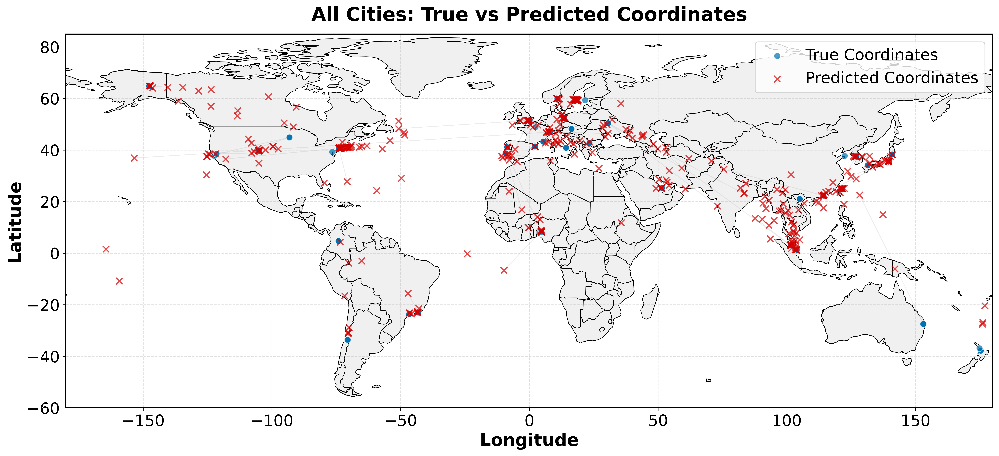
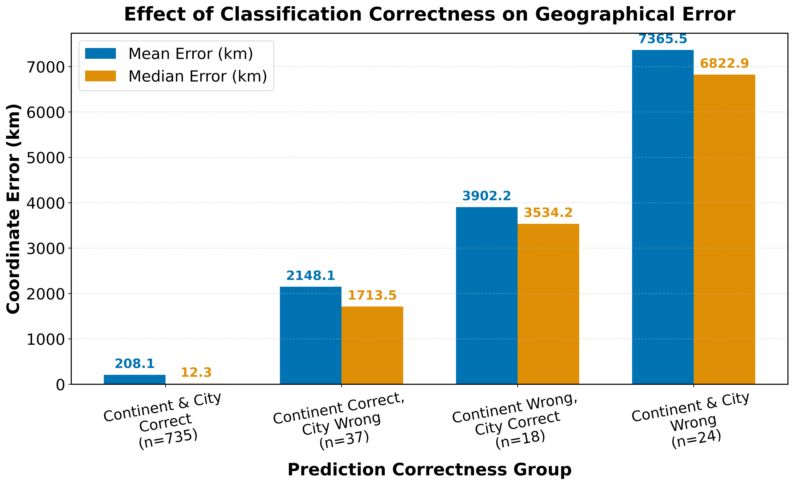

# mGPS Optimization

## BINP37: Research Project (15 cr)

This repository contains code, data, and documentation for hierarchical machine learning approaches to predict the geographic origin of environmental metagenomic samples. The project builds on the MetaSUB dataset and advances the state-of-the-art in microbiome geolocation, surpassing previous tools such as mGPS.

---

## 👤 Author

- [@ChandrashekarCR](https://github.com/ChandrashekarCR)

---

## 📝 Overview

Accurate prediction of sample origin from microbial signatures is crucial for biosurveillance, forensic science, and public health. This project introduces a robust ensemble learning framework leveraging neural networks, GrowNet, gradient boosting decision trees, and transformer-based models for improved classification and coordinate prediction.

---

## 🚀 Key Features

- **Hierarchical Prediction:**  
  Models predict continent, city, and precise coordinates in a sequential framework.
- **Ensemble Learning:**  
  Combines XGBoost, LightGBM, CatBoost, TabPFN, neural networks, and GrowNet using meta-models for optimal performance.
- **Error Propagation Analysis:**  
  Introduces a mathematical framework to quantify how misclassifications at higher levels affect coordinate predictions.
- **Advanced Feature Selection:**  
  Utilizes recursive feature elimination (RFE) and SMOTE for class imbalance correction.
- **Scalable Architecture:**  
  Designed to handle larger and more diverse datasets than previous approaches.

---

## 📊 Results

- **Median Coordinate Error:**  
  Ensemble model: **13.7 km** vs. mGPS: **137 km**
- **Classification Accuracy:**  
  95% continent, 93% city (MetaSUB dataset)
- **Robustness:**  
  Strong performance for underrepresented regions.
- **Fine-Scale Localization:**  
  Distinguishes neighborhoods/districts within cities.

### Global Distribution of MetaSUB Sampling Sites


### Taxonomic Diversity in MetaSUB Dataset


### All Cities: True vs Predicted Coordinates



### Effect of Classification Correctness on Geographical Error



---

## 📁 Repository Structure

```
binp37/
├── data/                # Raw and processed data
│   ├── metasub/         # MetaSUB dataset
│   ├── geopandas/       # Geospatial mapping data
├── notebooks/           # Jupyter notebooks
├── scripts/             # Preprocessing, modeling, feature engineering
│   ├── feature_engineering/  # Feature selection and taxonomic enrichment
│   ├── grownet/         # Hierarchical boosted neural networks
│   ├── nn_models/       # Separate and combined neural networks
│   ├── ensemble/        # Full ensemble pipeline
├── report/              # LaTeX manuscript source
│   ├── abstract/
│   ├── introduction/
│   ├── methods/
│   ├── results/
│   ├── discussions/
│   ├── references/
├── .gitignore           # Version control exclusions
```

---

## 🏁 Getting Started

**1. Clone the repository:**
```sh
git clone https://github.com/ChandrashekarCR/mgps_optimization.git
cd mgps_optimization
```

**2. Set up the environment:**
```sh
conda env create -f environment.yml
conda activate binp37_env
```

**3. Data Preparation:**

This step ensures your data is clean, consistent, and ready for modeling.

- **Preprocessing the MetaSUB Dataset**

  The main script for preprocessing is  
  `/scripts/data_preprocess/preprocess_metasub.py`.

  **Purpose:**  
  - Merges taxonomic abundance data with sample metadata.
  - Performs quality control, removing cities with insufficient samples.
  - Corrects mislabelled coordinates and harmonizes metadata fields.
  - Outputs a clean, analysis-ready CSV file.

  **Required Input Files:**  
  - Taxa abundance: `/data/metasub/metasub_taxa_abundance.csv`
  - Metadata: `/data/metasub/complete_metadata.csv`

  **How to Run:**
  ```sh
  python3 scripts/data_preprocess/preprocess_metasub.py \
    -m /data/metasub/complete_metadata.csv \
    -t /data/metasub/metasub_taxa_abundance.csv \
    -o /results/metasub/processed_metasub.csv
  ```
  - `-m`: Path to metadata file.
  - `-t`: Path to taxa abundance file.
  - `-o`: (Optional) Output file path for processed data.


  **Example Output:**  
  `/results/metasub/processed_metasub.csv`

  <table>
    <thead>
      <tr>
        <th>Index</th><th>Species A</th><th>Species B</th><th>Species C</th><th>Species D</th>
        <th>Continent</th><th>City</th><th>Latitude</th><th>Longitude</th>
      </tr>
    </thead>
    <tbody>
      <tr>
        <td>Sample1</td><td>0.12</td><td>0.34</td><td>0.56</td><td>0.78</td>
        <td>Europe</td><td>Paris</td><td>48.8566</td><td>2.3522</td>
      </tr>
      <tr>
        <td>Sample2</td><td>0.23</td><td>0.45</td><td>0.67</td><td>0.89</td>
        <td>Asia</td><td>Tokyo</td><td>35.6895</td><td>139.6917</td>
      </tr>
      <tr>
        <td>Sample3</td><td>0.31</td><td>0.21</td><td>0.41</td><td>0.61</td>
        <td>North Am.</td><td>New York</td><td>40.7128</td><td>-74.0060</td>
      </tr>
      <tr>
        <td>Sample4</td><td>0.15</td><td>0.25</td><td>0.35</td><td>0.55</td>
        <td>Africa</td><td>Nairobi</td><td>-1.2921</td><td>36.8219</td>
      </tr>
    </tbody>
  </table>

  > **Note:**  
  > Table values are illustrative and do not represent true dataset samples.

---

**4. Feature Engineering**

After preprocessing, two essential feature engineering steps help improve model performance:

### 4.1. **Feature Selection with RFE**

- **Script:**  
  `/scripts/feature_engineering/rfe_feature_selection.py`

  **Purpose:**  
  - Uses Recursive Feature Elimination (RFE) with cross-validation to select optimal feature subsets
  - Removes highly correlated features to reduce multicollinearity
  - Parallelizes computations for efficiency with large feature sets
  - Identifies the most predictive microbial features for geographical prediction

  **Required Input File:**  
  - Processed metadata file from previous step (e.g., `/results/metasub/processed_metasub.csv`)

  **How to Run:**
  ```sh
  python3 scripts/feature_engineering/rfe_feature_selection.py \
    -i /results/metasub/processed_metasub.csv \
    -o /results/metasub/selected_features.csv
  ```
  - `-i`: Path to processed metadata file.
  - `-o`: (Optional) Output file path for selected features.

  **Example Output:**  
  `/results/metasub/metasub_training_testing_data.csv`

---

## 🧠 Neural Network Models

### 1. `nn_model_revised.py` (Separate Neural Networks)

**Purpose:**  
Implements modular neural networks for continent/city classification and coordinate regression.  
Supports flexible architecture, dropout, batch normalization, and early stopping.

#### Separate Neural Networks Workflow


*This figure depicts the modular approach, where separate neural networks are trained for continent/city classification and coordinate regression, with feature augmentation between stages.*

**Key Features:**
- **Hierarchical Architecture:** Sequential prediction of continent → city → coordinates
- **Feature Augmentation:** Each stage uses predictions from previous stages as additional features
- **Customizable Network Design:** Flexible hidden layers, dropout rates, and activation functions
- **Hyperparameter Tuning:** Integrated Optuna support for architecture and training parameter optimization

**Usage:**  
```python
df = pd.read_csv("/home/chandru/binp37/results/metasub/metasub_training_testing_data.csv")
```
Replace the path with your own CSV file.

**Usage:**  
- For continent/city classification, use the `NNClassifier` class.
- For coordinate regression, use the `NNRegressor` class.
- Both support hyperparameter tuning via Optuna.

**How to Run:**  
```sh
python3 scripts/nn_models/nn_model_revised.py
```

---

### 2. `nn_combined_model_revised.py` (Combined Neural Network)

**Purpose:**  
Implements a combined neural network for hierarchical prediction:
- Predicts continent, then city (using continent probabilities), then coordinates (using both).

#### Combined Neural Network Workflow


*This diagram shows the hierarchical structure of the combined neural network model, where continent, city, and coordinates are predicted in sequence using shared and augmented features.*

**Key Features:**
- **End-to-End Architecture:** All predictions come from a single network with shared parameters
- **Branched Design:** Separate heads for continent, city, and coordinate prediction
- **Information Flow:** City prediction head receives continent probabilities; coordinate head receives both
- **Multi-Task Learning:** Weighted loss functions balance classification and regression objectives

**Usage:**  
```python
df = pd.read_csv("/home/chandru/binp37/results/metasub/metasub_training_testing_data.csv")
```
Replace the path with your own CSV file.

**Usage:**  
- Use the `CombinedHierarchicalNet` class for end-to-end hierarchical prediction.
- Training and evaluation functions are provided for the full pipeline.
- Supports Optuna tuning for architecture and loss weights.

**How to Run:**  
```sh
python3 scripts/nn_models/nn_combined_model_revised.py
```

---

## 🌿 GrowNet Model

### `hierarchical_grownet.py` (Hierarchical Boosted Neural Network)

**Purpose:**  
Implements GrowNet, a gradient boosting framework using neural networks as weak learners for hierarchical prediction.

**Key Features:**
- **Boosting-Based:** Builds an ensemble of weak neural networks sequentially, each improving upon previous predictions
- **Multi-Task Learning:** Each weak learner predicts continent, city, and coordinates simultaneously
- **Corrective Steps:** Periodically adjusts the ensemble weights for optimal performance
- **Gradient-Guided:** Uses functional gradients to direct the learning of each new weak learner

**Usage:**  
```python
df = pd.read_csv("/home/chandru/binp37/results/metasub/metasub_training_testing_data.csv")
```
Replace the path with your own CSV file.

**Usage:**  
- Use the `train_hierarchical_grownet` function to train the model.
- Supports class weighting, boosting, and Optuna-based hyperparameter tuning.

**How to Run:**  
```sh
python3 scripts/grownet/hierarchical_grownet.py
```
- For hyperparameter tuning, use the `HierarchicalGrowNetTuner` class.
- Input data should be processed using the provided `process_hierarchical_data` function.

---

## 🤖 Ensemble Learning Model

### `main.py` (Customizable Hierarchical Ensemble)

**Purpose:**  
Implements a flexible, state-of-the-art hierarchical ensemble learning pipeline for metagenomic geolocation.  
Combines multiple models (XGBoost, LightGBM, CatBoost, TabPFN, GrowNet, Neural Networks) for continent, city, and coordinate prediction, and achieves best-in-class performance.

#### Ensemble Learner Workflow


*This workflow illustrates the ensemble learning pipeline, combining predictions from multiple models (XGBoost, LightGBM, CatBoost, TabPFN, GrowNet, Neural Networks) at each hierarchical layer, and using meta-models for final prediction.*

**Note:**  
The data file path is hardcoded in the script for demonstration and development purposes.  
To use your own data, open `scripts/ensemble/main.py` and modify the line:
```python
df = pd.read_csv("/home/chandru/binp37/results/metasub/metasub_training_testing_data.csv")
```
Replace the path with your own CSV file.

**Key Features:**  
- **Modular Design:**  
  Each model (XGBoost, LightGBM, CatBoost, TabPFN, GrowNet, Neural Networks) is implemented in its own script under `scripts/ensemble/`, making it easy to add, remove, or update models.
- **Customizable Model Selection:**  
  For each layer (continent, city, coordinates), you can specify which models to use by passing their respective functions.  
  Example:
  ```python
  continent_model, meta_X_train_cont, meta_X_test_cont, cont_train_preds, cont_test_preds = train_hierarchical_layer(
      X_train=X_train_cont,
      X_test=X_test_cont,
      y_train=y_train_cont,
      y_test=y_test_cont,
      run_xgboost_classifier=run_xgboost_classifier,
      run_grownet_classifier=run_grownet_classifier,
      run_nn_classifier=run_nn_classifier,
      run_tabpfn_classifier=run_tabpfn_classifier,
      run_lightgbm_classifier=run_lightgbm_classifier,
      run_catboost_classifier=run_catboost_classifier,
      tune_hyperparams=True,
      apply_smote=True,
      n_splits=5,
      accuracy_threshold=0.93
  )
  ```
- **Automatic Model Filtering:**  
  The pipeline runs cross-validation and automatically filters out underperforming models based on accuracy thresholds you set.
- **Hyperparameter Tuning:**  
  Optionally tune hyperparameters for selected models using Optuna.  
  Set `tune_hyperparams=True` to enable.
- **Meta-modeling:**  
  Out-of-fold predictions from base models are used to train a meta-model (e.g., XGBoost) for improved accuracy.
- **Class Imbalance Handling:**  
  SMOTE oversampling can be enabled for imbalanced datasets.
- **Detailed Error Analysis:**  
  The pipeline computes classification reports, coordinate error statistics, and in-radius accuracy metrics for all layers.

**How to Run:**  
```sh
python3 scripts/ensemble/main.py
```
- To use your own data, modify the file path in the script as described above.

**How It Works:**  
1. **Prepare Data:**  
   Preprocess and split your data as described above.

2. **Configure Models for Each Layer:**  
   For each hierarchical layer (continent, city, coordinates), specify which models to use by passing their function or `None`.  
   The pipeline is modular—each model is implemented in its own script (e.g., `grownet_classification.py`, `xgboost_classification.py`, etc.) and can be swapped in or out.

3. **Run the Pipeline:**  
   - The pipeline runs cross-validation to evaluate each model.
   - Models meeting the accuracy threshold are selected.
   - Hyperparameter tuning is performed if enabled.
   - Out-of-fold predictions are generated and used to train a meta-model.
   - Final predictions and error metrics are computed and saved.

4. **Output:**  
   - Returns trained meta-models, predictions, and evaluation metrics for each layer.
   - Saves predictions and error analysis for further inspection.

**Recommended Workflow:**  
- Start by enabling all models for each layer and let the pipeline filter out the best performers.
- For large datasets, restrict to faster models or those that support GPU.
- Use the error analysis and plotting functions to interpret results and visualize predictions.

**Why Use This Ensemble?**  
- The ensemble model achieves a median coordinate error of **13.7 km**, beating previous state-of-the-art methods, mGPS **137 km**.
- Modular scripts allow rapid experimentation and integration of new models.
- Designed for scalability, robustness, and reproducibility.


---

## 📚 References

- [MetaSUB Project](https://www.sciencedirect.com/science/article/pii/S0092867421005857)
- [mGPS: Microbiome Global Population Structure](https://academic.oup.com/gbe/article/16/11/evae209/7814710?login=false#498946344)

---

## 🙏 Acknowledgements

> Supervised by Eran Elhaik, with input from Bijan Mousavi and Sreejith.  
> For questions or contributions, open an issue or contact the author.

---